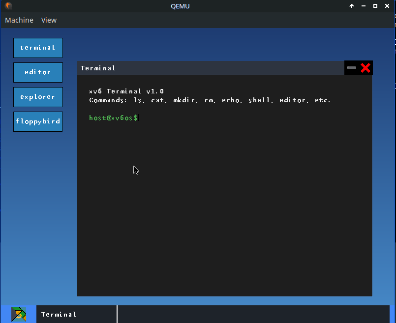

# xv6OS with GUI
Modified version of MIT xv6 (x86) with a custom graphical user interface and window manager.



## Overview
This project transforms the traditional xv6 teaching OS into a graphical environment. It features a monolithic kernel with multi-processor support, a VGA-based window manager, and a set of graphical user applications.

## Core Features
*   **Monolithic Kernel**: Unix-inspired design with preemptive multitasking.
*   **GUI Subsystem**: Kernel-level window manager and drawing primitives.
*   **Mouse Support**: Integrated PS/2 mouse driver.
*   **Userland Apps**: terminal, File Explorer, Text Editor, and Games (Floppy Bird).
*   **Icon System**: Automated PNG-to-C array conversion for UI assets.

## Toolchain & Requirements
The build system is strictly targeted for **Linux** environments (native or WSL2).

### Required Packages (Linux)
*   `gcc`: With 32-bit support (`gcc-multilib`).
*   `binutils`: i386-elf support.
*   `qemu-system-i386`: For emulation.
*   `make`: Build automation.
*   `golang`: Go compiler (1.20+) for build utilities.
*   `python3` + `Pillow`: For asset processing.

### Installation (Debian/Ubuntu)
```bash
sudo apt update
sudo apt install build-essential qemu-system-x86 golang python3 python3-pip
pip3 install Pillow
```

## Build and Execution
The `Makefile` handles the entire toolchain process.

### Compilation
Build the kernel, userland, and disk images:
```bash
make -j$(nproc)
```

### Running in QEMU
Start the OS in the emulator:
```bash
make run
```

## Asset Conversion Scripts

### convert.py
Converts window UI icons (close button, minimize button) from PNG to C arrays.
```bash
python3 convert.py
```

### font.py
Converts TrueType font (fonts/font.ttf) to bitmap character arrays for text rendering.
```bash
python3 font.py
```

### convert_icons.py
Converts desktop application icons from PNG to C arrays. Place 48x48 PNG files in `app_icons/` directory.
```bash
python3 convert_icons.py
```

## Project Structure
*   `kernel/`: Process scheduling, memory, FS, and GUI kernel logic.
*   `user/`: User-space applications and libraries.
*   `include/`: Shared headers.
*   `icon/`: PNG assets for window UI.
*   `app_icons/`: PNG assets for desktop applications.
*   `fonts/`: TrueType fonts for text rendering.
*   `scripts/`: Build-time Go/Python scripts.

## Build Process Analysis
1.  `convert.py` scans `icon/*.png` and generates `icons_data.c`.
2.  `font.py` converts `fonts/font.ttf` to `character.c` and `character.h`.
3.  `convert_icons.py` scans `app_icons/*.png` and generates `app_icons_data.c` and `app_icons.h`.
4.  GCC compiles kernel and user sources with `-m32` for i386.
5.  Linker scripts (`kernel.ld`) organize the binary structure.
6.  `mkfs` utility creates the `fs.img` with user programs.
7.  `dd` assembles the bootblock and kernel into `xv6OS.img`.

## License
MIT License. Derived from MIT xv6-public.
